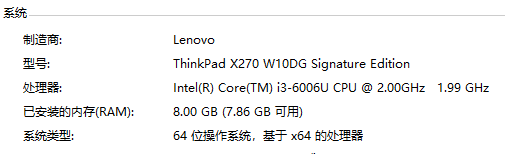
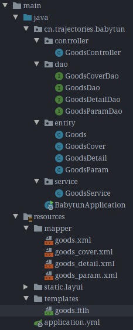
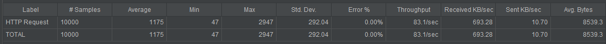
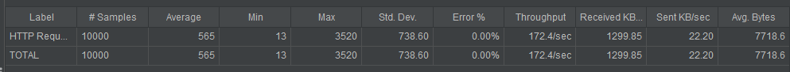
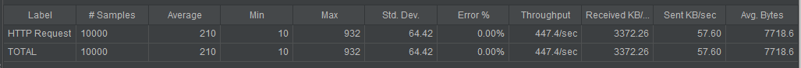

# 初探高并发编程：秒杀系统

### 一、最原始网页

#### 1. 开发环境

- IDEA
- Spring-Boot 2.2.0+
- MySQL5.6+
- jdk8+
- MyBatis
- Freemarker
- Redis 5.0.3
- swagger2.0

本项目的所有接口api可以查看：http://.../swagger-ui.html

#### 2. 部署环境

1）除MySQL、Redis外，所有的网页、中间件等都部署在本地win10电脑，配置如下

2）MySQL5.7 和 Redis 5.0.3 部署在了本地的centos7虚拟机上

#### 3. 创建数据库/创建项目工程

- 导入数据库脚本，建立好数据库
- 数据库脚本见数据库脚本文件夹中
- 创建工程，配置好环境

#### 4. 搭建初始商品购买网页

原本静态的商品购买页面，用从数据库中读取各个商品的数据进行填充，实现不同商品信息的动态查询展示。此时的项目结构如下图

访问网址例如：http://localhost:8080/good?gid=739

- gid=商品编号

#### 5. 第一次JMeter压测：仅测试访问商品的信息页面

JMeter的参数设置见JMeter文件夹

模拟100个用户，每个用户作100次的访问

- 吞吐量每秒83.1次

- 平均延迟1.175秒

### 二、静态数据优化

在访问商品信息页面的时候，存在很多静态的、不怎么改动的静态资源信息需要从数据库中读取出来，这部分可以利用缓存等技术进行优化，减少对数据库的访问，提高访问性能

#### 1. Redis缓存 feature/staticResImpro-Redis分支
在pox.xml导入redis和cache的依赖，然后在启动文件中加上@EnableCaching的注解，并在service文件中相应的方法上加入@Cacheable引入缓存

#### 2. 第二次访问商品信息页面JMeter压测：加入Redis缓存后
JMeter的参数设置见JMeter文件夹

模拟100个用户，每个用户作100次的访问

1）一次

2）再一次

- 可以从吞吐量等指标看出，加入redis缓存对静态资源访问的优化效果较为明显

#### 3. 静态化处理等
对于访问静态页面数据的优化方法还有很多，比如页面的静态化处理等，这里就不赘述了
